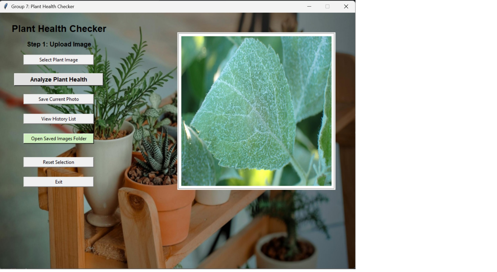

# Plant Health Checker

A computer vision based machine learning system that detects plant diseases from leaf images.

## Overview

This project uses a Convolutional Neural Network (CNN) trained on the PlantVillage dataset to classify plant diseases from images.  
A graphical user interface (GUI) built using Tkinter allows users to upload plant images and receive disease predictions in real time.

## Features

- Image-based plant disease detection
- CNN deep learning model
- Tkinter desktop GUI application
- Prediction history logging
- Plant validation using MobileNetV2
- Disease treatment recommendations

## Dataset

PlantVillage dataset containing multiple crop disease classes.
The system supports classification of **38 plant disease categories** including apple scab, grape black rot, tomato diseases, potato blight, and more.

## Model Architecture

The CNN model includes:

- Convolution layers for feature extraction
- Max pooling for dimensionality reduction
- Fully connected layers for classification
- Dropout to prevent overfitting

The model is trained using Adam optimizer and categorical cross entropy loss. 

## Technologies Used

Python  
TensorFlow / Keras  
OpenCV  
Tkinter  
Pandas  
NumPy  

## How to Run

```bash
pip install -r requirements.txt
python gui_interface.py

```
## Application Interface

Below is the graphical user interface of the Plant Health Checker application:



## Example Prediction

Below is an example disease prediction generated by the model.


